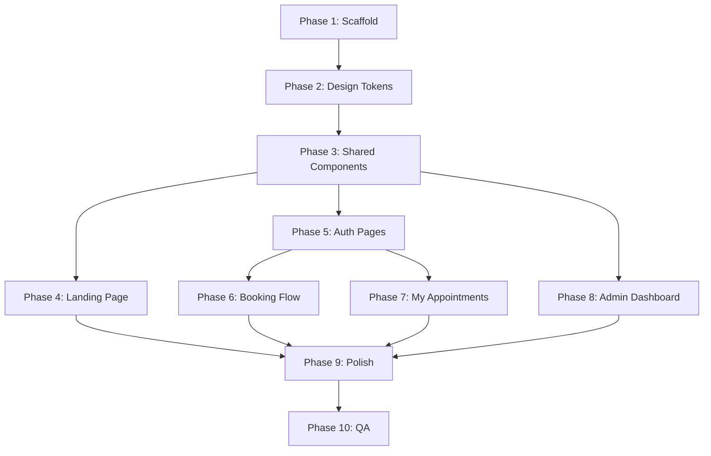

# Dental Clinic: Design Review + Implementation Plan

**Date:** 2026-07-30
**Inputs:** [DESIGN.md](file:///d:/client_project/docs/DESIGN.md) | [ARCHITECTURE.md](file:///d:/client_project/ARCHITECTURE.md) | [Existing backend](file:///d:/client_project/backend/app)

---

## Part 1: Design Review

The DESIGN.md is thorough, opinionated, and internally consistent. Five items worth addressing before we start building:

### Feedback

| # | Area | Issue | Recommendation |
|---|------|-------|----------------|
| 1 | **Font hosting (S4.4)** | Spec says self-hosted `@font-face` with `font-display: swap`, but Satoshi is a paid/licensed font from Fontshare. Need to confirm licensing or switch. | **Use Fontshare CDN** (free for web, no account needed) for Satoshi, self-host Inter and JetBrains Mono from Google Fonts downloads. Alternatively, swap Satoshi for **General Sans** (also Fontshare, free, similar geometric feel). |
| 2 | **Dark mode scope (S9.1)** | Auto-only via `prefers-color-scheme` with no toggle. On mobile, many users don't know how to change their OS theme. A manual toggle is cheap to add. | **Keep auto as default**, but add a small sun/moon toggle in the footer or nav. Store preference in `localStorage`, override the media query with a `[data-theme="dark"]` attribute on `<html>`. Add in Phase 9 (polish), not Phase 1. |
| 3 | **Calendar swipe (S6.3)** | "Swipeable on mobile" is spec'd but no implementation detail. Touch gesture handling is non-trivial. | Use CSS `scroll-snap` on a horizontal month strip rather than a full swipe gesture library. Keep the left/right arrow nav as primary. Defer swipe to polish phase. |
| 4 | **Skeleton loading (S12.2)** | "Skeleton components matching the exact layout shape" for every data component is high-effort. | Build **one generic `Skeleton` component** with `width`, `height`, `borderRadius` props + shimmer animation. Compose it inline in each page's loading state. No separate skeleton-per-component files. |
| 5 | **Admin CSS lazy-loading (S6.1, S12.1)** | `admin/admin.css` loaded lazily with admin routes is correct, but CSS modules already scope per-component. A separate `admin.css` override file risks specificity conflicts. | Drop the standalone `admin/admin.css`. Admin components use `.module.css` like everything else. The lazy-loading boundary is at the route level via `React.lazy()`, which already code-splits the admin CSS with the admin JS. |

> [!NOTE]
> None of these are blockers. Items 1 and 5 should be decided now; items 2, 3, 4 can be deferred to polish.

---

## Part 2: Implementation Plan

### Scope

**Frontend only.** The backend is already scaffolded with all models, routes, services, schemas, and the Intelligence Engine ([scheduler.py](file:///d:/client_project/backend/app/services/scheduler.py)). The frontend directory is currently empty (just a `.gitkeep`).

### Phasing Strategy

```mermaid
gantt
    title Frontend Build Phases
    dateFormat X
    axisFormat %s
    section Foundation
    P1 Scaffold + Tooling       :p1, 0, 1
    P2 Design Tokens + CSS      :p2, after p1, 1
    section Components
    P3 Shared Components        :p3, after p2, 2
    section Patient Pages
    P4 Landing Page             :p4, after p3, 1
    P5 Auth Pages               :p5, after p3, 1
    P6 Booking Flow             :p6, after p5, 2
    P7 My Appointments          :p7, after p5, 1
    section Admin
    P8 Admin Dashboard          :p8, after p3, 3
    section Polish
    P9 Dark Mode + A11y + Motion :p9, after p8, 1
    P10 Integration + QA         :p10, after p9, 1
```

> [!IMPORTANT]
> P4-P7 (patient pages) and P8 (admin) can run in parallel after P3 completes. The critical path is P1 -> P2 -> P3 -> P8 -> P9 -> P10.

---

### Phase 1: Scaffold + Tooling

Bootstrap the Vite+React project inside `frontend/`.

| Task | Details |
|------|---------|
| **1.1** Create Vite project | `npx -y create-vite@latest ./ --template react-ts` inside `frontend/`. |
| **1.2** Install dependencies | `react-router-dom`, plus dev deps for types. No UI library. No Tailwind. |
| **1.3** Configure path aliases | `vite.config.ts`: alias `@shared`, `@patient`, `@admin`, `@styles` to `src/` subdirectories. Update `tsconfig.json` paths. |
| **1.4** Set up directory structure | Create the folder tree from DESIGN.md S6.1: `src/styles/`, `src/shared/components/`, `src/patient/components/`, `src/patient/pages/`, `src/admin/components/`, `src/admin/pages/`. |
| **1.5** Set up routing skeleton | `App.tsx` with React Router: public routes (`/`, `/login`, `/register`), patient-protected routes (`/book`, `/my-appointments`), admin routes (`/admin/login`, `/admin/*`) with `React.lazy()`. Placeholder page components returning the route name. |
| **1.6** API client | `src/shared/api/client.ts`: thin fetch wrapper with base URL from env, JSON parsing, auth header injection, error normalization. |
| **1.7** Auth context | `src/shared/context/AuthContext.tsx`: patient JWT in memory + localStorage, `login()`, `logout()`, `register()`, `isAuthenticated`. Admin auth uses cookies (browser handles automatically). |
| **1.8** Admin auth context | `src/admin/context/AdminAuthContext.tsx`: `login()`, `logout()`, `isAuthenticated` (calls `/api/v1/admin/auth/me` to check cookie). |
| **1.9** Protected route wrappers | `<PatientRoute>` redirects to `/login`, `<AdminRoute>` redirects to `/admin/login`. |

**Acceptance:** `npm run dev` starts, all routes render placeholder text, no console errors.

**Files created:**
- `frontend/package.json`, `frontend/vite.config.ts`, `frontend/tsconfig.json`
- `frontend/src/App.tsx`, `frontend/src/main.tsx`
- `frontend/src/shared/api/client.ts`
- `frontend/src/shared/context/AuthContext.tsx`
- `frontend/src/admin/context/AdminAuthContext.tsx`
- `frontend/src/shared/components/PatientRoute.tsx`, `AdminRoute.tsx`
- Placeholder page files for all 7 routes

---

### Phase 2: Design Tokens + CSS Foundation

Implement the design system from DESIGN.md as pure CSS.

| Task | Details |
|------|---------|
| **2.1** `tokens.css` | All CSS custom properties from DESIGN.md S3-S5, S8.1: colors, typography scale, spacing, radii, shadows, easings, durations. Light mode defaults + `@media (prefers-color-scheme: dark)` overrides. |
| **2.2** `reset.css` | Modern CSS reset: `box-sizing: border-box` on everything, zero margins, font smoothing, `img { display: block; max-width: 100% }`, remove default list styles, set base `font-family` to Inter. |
| **2.3** `base.css` | HTML element defaults: heading styles (Satoshi, weights from S4.3), paragraph/body (Inter), link styles, focus-visible outlines using `--color-focus`. |
| **2.4** `utilities.css` | Minimal utility classes: `.container` (max-width + centered + padding), `.section-padding`, `.sr-only`, `.skeleton-shimmer`. |
| **2.5** Font loading | Download Inter + JetBrains Mono woff2 files, place in `frontend/public/fonts/`. Add Fontshare CDN link for Satoshi in `index.html` `<head>`. `@font-face` declarations in `base.css`. |
| **2.6** Wire CSS into app | Import order in `main.tsx`: `reset.css` -> `tokens.css` -> `base.css` -> `utilities.css`. |

**Acceptance:** App renders with correct fonts, colors, spacing visible on placeholder pages. Dark mode toggles correctly with OS setting.

**Files created:**
- `frontend/src/styles/tokens.css`
- `frontend/src/styles/reset.css`
- `frontend/src/styles/base.css`
- `frontend/src/styles/utilities.css`
- `frontend/public/fonts/` (Inter, JetBrains Mono woff2 files)

---

### Phase 3: Shared Components

Build the 12 shared components from DESIGN.md S6.3.

| Task | Component | Key specs |
|------|-----------|-----------|
| **3.1** | `Button` | Primary/secondary/ghost variants, default/small sizes, loading state with `Spinner`, `scale(0.97)` active, 200ms transitions. `.module.css` scoped. |
| **3.2** | `Card` | Static/interactive/elevated variants. Border, radius, shadow per spec. |
| **3.3** | `Badge` + `StatusBadge` | Pill shape, dot indicator, color-mapped from status. `StatusBadge` is a `Badge` preset for appointment statuses. |
| **3.4** | `Input` | 44px height, label above, focus ring, error state with message below. Support `type="text"`, `"email"`, `"password"`, `"tel"`, `"date"`. Wrap `<textarea>` variant. |
| **3.5** | `Modal` | Overlay with blur, scale-up animation, Escape to close, focus trap, portal via `createPortal`. Max-width variants. |
| **3.6** | `Spinner` | Simple CSS-only spinner, two sizes (16px for buttons, 32px for page). Uses `--color-accent`. |
| **3.7** | `EmptyState` | SVG illustration slot, heading, subtext, optional CTA button. |
| **3.8** | `Skeleton` | Generic block with width/height/borderRadius props, shimmer animation (CSS gradient sweep). Composable. |
| **3.9** | `Toast` | Slide-in from top-right, auto-dismiss 4s, manual dismiss. Toast context + `useToast()` hook. Success/error/info variants. |
| **3.10** | `Calendar` | 7-column grid, month navigation, cell click handler, crowd meter dots, blocked dates (gray + not-allowed). Props: `selectedDate`, `onSelect`, `crowdData`, `blockedDates`. |
| **3.11** | `CrowdMeter` (legend) | Three pills: green/orange/red with labels. Placed below Calendar. |
| **3.12** | `Navbar` | Logo + nav links + CTA. Transparent on hero -> solid on scroll. Hamburger menu on mobile. Sticky. |

**Acceptance:** All components render correctly in isolation (manually verify via a temp `/dev` route or Storybook-like page). All states (hover, focus, loading, empty, error) visually correct.

**Files created (per component):**
- `frontend/src/shared/components/{Name}.tsx`
- `frontend/src/shared/components/{Name}.module.css`
- `frontend/src/shared/context/ToastContext.tsx` (for Toast)

---

### Phase 4: Landing Page

| Task | Details |
|------|---------|
| **4.1** | `HeroSection` component: H1 (Satoshi 900), subtext (Inter 400, max-width 55ch), CTA button, optional clinic photo. Fits viewport. |
| **4.2** | `ServiceCard` component: icon + service name + short description. Fetches from `GET /api/v1/services`. Horizontal scroll-snap on mobile, 3-column grid on desktop. |
| **4.3** | "Why Choose Us" section: 3 value props with icons, asymmetric grid on desktop, single-column on mobile. |
| **4.4** | CTA section: heading + subtext + button. Links to `/book` (or `/login` if unauthenticated). |
| **4.5** | `Footer` component: clinic name, address, phone, hours. Stacked mobile, 3-column desktop. |
| **4.6** | Assemble `LandingPage.tsx`: Hero + Services + Values + CTA + Footer. Wire Navbar with transparent-on-hero scroll behavior. |
| **4.7** | Scroll-reveal animation: `IntersectionObserver`-based fade-up on sections (600ms, 100ms stagger). Respects `prefers-reduced-motion`. |

**Acceptance:** Landing page renders fully, services fetched from API, all sections visible, responsive at 375px/768px/1024px.

**Files created:**
- `frontend/src/patient/components/HeroSection.tsx` + `.module.css`
- `frontend/src/patient/components/ServiceCard.tsx` + `.module.css`
- `frontend/src/patient/components/Footer.tsx` + `.module.css`
- `frontend/src/patient/pages/LandingPage.tsx` + `.module.css`
- `frontend/src/shared/hooks/useScrollReveal.ts`

---

### Phase 5: Auth Pages

| Task | Details |
|------|---------|
| **5.1** | `AuthForm` shared component: centered card layout, logo at top, title, form fields via `Input`, submit `Button`, link below. Handles loading + error states. |
| **5.2** | `LoginPage.tsx`: email + password + "Remember me" checkbox. Calls `POST /api/v1/auth/login`. Redirects to `/book` (or return URL from query param). |
| **5.3** | `RegisterPage.tsx`: name, email, password, phone (optional), DOB (optional). Calls `POST /api/v1/auth/register`. Auto-login on success. |
| **5.4** | `AdminLoginPage.tsx`: password-only field + "Remember me". Lock icon. Calls `POST /api/v1/admin/auth/login`. Redirects to `/admin/dashboard`. |

**Acceptance:** Patient can register, login, see JWT stored, access protected routes. Admin can login with seeded password, cookie set, access admin routes.

**Files created:**
- `frontend/src/patient/components/AuthForm.tsx` + `.module.css`
- `frontend/src/patient/pages/LoginPage.tsx`
- `frontend/src/patient/pages/RegisterPage.tsx`
- `frontend/src/admin/pages/AdminLoginPage.tsx` + `.module.css`

---

### Phase 6: Booking Flow

| Task | Details |
|------|---------|
| **6.1** | `BookingPage.tsx` with 3-step state machine: `service` -> `date` -> `confirm`. Progress indicator (3 dots/labels) at top. |
| **6.2** | Step 1: Service selection. Radio-style cards, fetched from `GET /api/v1/services`. "Other" option with textarea. "Continue" button. |
| **6.3** | Step 2: Date picker. Renders `Calendar` + `CrowdMeter`. Fetches `GET /api/v1/availability/calendar?month=YYYY-MM`. Blocked dates from unavailability. "Continue" button. |
| **6.4** | Step 3: Confirmation. Summary card (service name + date). "Confirm Booking" button. Calls `POST /api/v1/appointments`. On success, redirect to `/my-appointments` with toast. |
| **6.5** | Error handling: API errors shown as toast. Network errors shown inline with retry. |

**Acceptance:** Full booking flow works end-to-end against running backend. Crowd meter colors correct. Blocked dates not selectable. Appointment appears in DB after confirmation.

**Files created:**
- `frontend/src/patient/pages/BookingPage.tsx` + `.module.css`
- `frontend/src/patient/components/ServiceSelector.tsx` + `.module.css`
- `frontend/src/patient/components/BookingConfirmation.tsx` + `.module.css`

---

### Phase 7: My Appointments

| Task | Details |
|------|---------|
| **7.1** | `AppointmentCard` component: date, status badge, service name, details (time slot if accepted, reason if rejected). Cancel button on pending. |
| **7.2** | `MyAppointmentsPage.tsx`: fetches `GET /api/v1/appointments`, renders list sorted newest first. Empty state if no appointments. "New Appointment" button links to `/book`. |
| **7.3** | Cancel flow: confirmation modal, calls `PATCH /api/v1/appointments/:id/cancel`, toast on success, refreshes list. |

**Acceptance:** Patient sees their appointments with correct statuses and actions. Cancel works. Empty state shown for new patients.

**Files created:**
- `frontend/src/patient/components/AppointmentCard.tsx` + `.module.css`
- `frontend/src/patient/pages/MyAppointmentsPage.tsx` + `.module.css`

---

### Phase 8: Admin Dashboard

The largest phase. Builds the lazy-loaded admin shell and all 6 sections.

| Task | Details |
|------|---------|
| **8.1** | `AdminLayout.tsx`: sidebar (desktop) / bottom tabs (mobile) shell. Sidebar: 6 nav items with icons. Content area is an `<Outlet>`. |
| **8.2** | `Sidebar.tsx` + `.module.css`: collapsible on tablet, fixed on desktop, bottom-tab-bar on mobile. Active link highlight. |
| **8.3** | `StatCard.tsx`: metric label + value + optional trend. Used on Home section. |
| **8.4** | **Home section** (`AdminHomePage.tsx`): 4 stat cards (today's count, pending, total patients, today's schedule). Recent activity list. Fetches from `GET /api/v1/admin/stats`. |
| **8.5** | `AppointmentRow.tsx`: patient name, date, service, time since created. Accept/Reject action buttons. |
| **8.6** | **Requests section** (`AdminRequestsPage.tsx`): filtered list of pending appointments. Each row has Accept (opens TimeSlotPicker modal) and Reject (opens reason modal). |
| **8.7** | `TimeSlotPicker.tsx` + `.module.css`: 30-min interval grid. Fetches existing bookings + unavailability for the date, marks slots as available/booked/unavailable. Selection state. |
| **8.8** | Accept flow: opens `TimeSlotPicker` in a `Modal`. On select + confirm, calls `PATCH /api/v1/admin/appointments/:id/accept`. Handles 409 conflict inline. |
| **8.9** | Reject flow: opens `Modal` with textarea for reason + optional date picker for suggested date. Calls `PATCH /api/v1/admin/appointments/:id/reject`. |
| **8.10** | **Today section** (`AdminTodayPage.tsx`): chronological list of today's accepted appointments. "Arrived" button -> marks `arrived_at`. "Complete" button -> marks completed + opens PrescriptionForm. |
| **8.11** | `PrescriptionForm.tsx`: modal form with diagnosis textarea, medicines (add/remove rows: name, dosage, frequency, duration), notes. Calls `POST /api/v1/admin/prescriptions`. |
| **8.12** | **Patients section** (`AdminPatientsPage.tsx`): search input (name/email filter), patient list. Click row -> expanded view with appointment history. Fetches `GET /api/v1/admin/patients`. |
| **8.13** | `PatientRow.tsx` + patient detail expansion: shows appointment history, prescriptions. |
| **8.14** | **Schedule section** (`AdminSchedulePage.tsx`): list existing unavailability entries with delete. Add form: date, start/end time, recurring dropdown (none/weekly/weekdays), reason. Calls `POST /api/v1/admin/unavailability`. |
| **8.15** | **Settings section** (`AdminSettingsPage.tsx`): clinic info form (name, address, phone). Change password form (current, new, confirm). Calls `PATCH /api/v1/admin/settings`. |

**Acceptance:** All 6 admin sections functional against live API. Accept/reject workflow works end-to-end with Intelligence Engine conflict detection. Prescription form saves. Unavailability blocks calendar dates.

**Files created:**
- `frontend/src/admin/components/Sidebar.tsx` + `.module.css`
- `frontend/src/admin/components/StatCard.tsx` + `.module.css`
- `frontend/src/admin/components/AppointmentRow.tsx` + `.module.css`
- `frontend/src/admin/components/TimeSlotPicker.tsx` + `.module.css`
- `frontend/src/admin/components/PrescriptionForm.tsx` + `.module.css`
- `frontend/src/admin/components/PatientRow.tsx` + `.module.css`
- `frontend/src/admin/pages/AdminLayout.tsx` + `.module.css`
- `frontend/src/admin/pages/AdminHomePage.tsx` + `.module.css`
- `frontend/src/admin/pages/AdminRequestsPage.tsx` + `.module.css`
- `frontend/src/admin/pages/AdminTodayPage.tsx` + `.module.css`
- `frontend/src/admin/pages/AdminPatientsPage.tsx` + `.module.css`
- `frontend/src/admin/pages/AdminSchedulePage.tsx` + `.module.css`
- `frontend/src/admin/pages/AdminSettingsPage.tsx` + `.module.css`

---

### Phase 9: Dark Mode + Accessibility + Motion Polish

| Task | Details |
|------|---------|
| **9.1** | Dark mode toggle: sun/moon icon in Navbar. `localStorage` preference. `[data-theme="dark"]` on `<html>` overrides `prefers-color-scheme`. Verify all pages in dark mode. |
| **9.2** | Accessibility audit: verify all contrast ratios (WCAG AA), focus rings on every interactive element, all inputs have labels, all images have alt text, keyboard navigation works through all flows. |
| **9.3** | `prefers-reduced-motion`: wrap all animations in media query. Test with OS reduced-motion enabled. |
| **9.4** | Page transitions: subtle opacity fade (300ms) on route changes via React Router transition API or CSS. |
| **9.5** | Micro-interactions: status-change highlight pulse, toast slide-in tuning, modal open/close polish. |
| **9.6** | SEO: `<title>` tags per page, meta descriptions, semantic HTML audit (`<main>`, `<nav>`, `<article>`, `<section>`), proper heading hierarchy. |

**Acceptance:** Dark mode looks correct on all pages. No accessibility violations on major flows. All animations collapse with reduced-motion. Lighthouse accessibility score >= 90.

---

### Phase 10: Integration + QA

| Task | Details |
|------|---------|
| **10.1** | Full end-to-end walkthrough: register patient -> book appointment -> admin accepts with time slot -> patient sees accepted with time -> admin marks arrived -> admin completes with prescription -> patient sees completed. |
| **10.2** | Error scenarios: network failure handling, 409 conflict display, invalid form submission, expired JWT redirect. |
| **10.3** | Responsive audit: test at 375px (iPhone SE), 768px (iPad), 1024px (laptop), 1440px (desktop). |
| **10.4** | Build verification: `npm run build` succeeds. Verify admin code is in a separate chunk (network tab). |
| **10.5** | Update project docs: `HANDOFF.md`, `TASKS.md`, `MEMORY.md` to reflect completed frontend. |

**Acceptance:** All flows work against running backend. Production build succeeds. Admin bundle is code-split.

---

### Dependency Graph

---

### Execution Order for Serial Agent

If tasks are executed one-at-a-time by a single agent, the optimal order is:

1. P1 (all tasks)
2. P2 (all tasks)
3. P3.1-P3.9 (non-calendar components)
4. P3.12 (Navbar, needed by landing)
5. P4 (Landing page)
6. P5 (Auth pages)
7. P3.10-P3.11 (Calendar + CrowdMeter, needed by booking)
8. P6 (Booking flow)
9. P7 (My Appointments)
10. P8.1-P8.3 (Admin shell + layout)
11. P8.4 (Home)
12. P8.5-P8.9 (Requests + accept/reject flows)
13. P8.10-P8.11 (Today + prescriptions)
14. P8.12-P8.13 (Patients)
15. P8.14 (Schedule)
16. P8.15 (Settings)
17. P9 (Polish)
18. P10 (QA)
