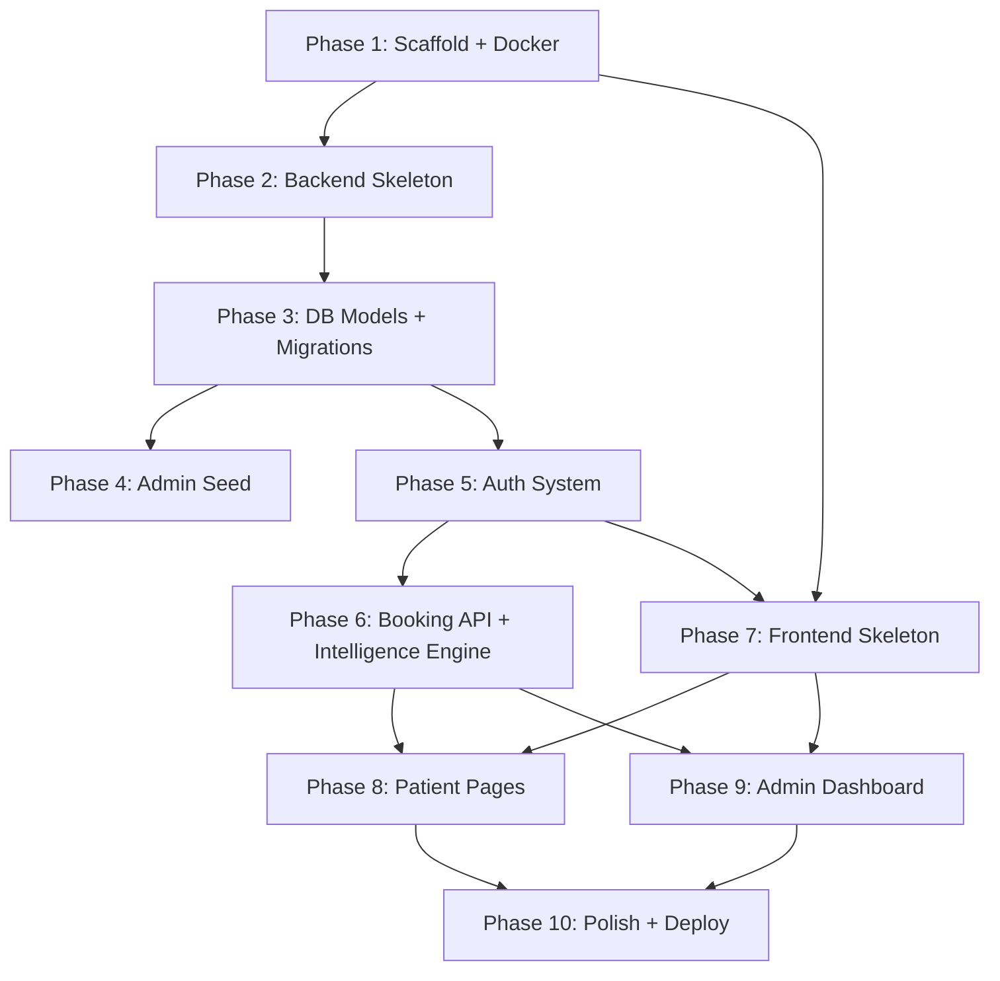

# Implementation Plan — Dental Clinic Management System

**Date:** 2026-07-30
**Source:** [specs/2026-07-30-dental-clinic-design.md](file:///d:/client_project/specs/2026-07-30-dental-clinic-design.md)
**Status:** Draft — awaiting approval

---

## Pre-Implementation Notes

### Spec Issues Resolved

| # | Issue | Resolution |
|---|-------|------------|
| 1 | HANDOFF.md references wrong spec path | Ignored — cosmetic |
| 2 | Spec §3 says "see ARCHITECTURE.md" for endpoints but it only has 3 flows | Plan enumerates all endpoints explicitly in Phase 6 |
| 3 | Patient refresh tokens mentioned in spec but not in ARCHITECTURE.md | Plan includes access + refresh token for patients |
| 4 | Crowd meter thresholds not in spec | Using ADR 0004 values: Green=0-3, Orange=4-7, Red=8+ |
| 5 | `cancelled` status in enum but no flow documented | Patient can cancel `pending` appointments only |

### Constraints (from AGENTS.md)

- No comments in code unless explicitly asked
- No Tailwind — vanilla CSS only
- No generic templates (shadcn, MUI, etc.)
- Mobile-first strictly
- Admin code lazy-loaded via `React.lazy()`
- Never commit without explicit instruction

---

## Phase 1: Monorepo Scaffold + Docker

**Goal:** Create the directory structure, Docker Compose for local PostgreSQL, and config files.

### Files to Create

```
d:\client_project\
├── docker-compose.yml
├── .gitignore
├── frontend/
│   └── (empty — scaffolded in Phase 7)
├── backend/
│   └── (empty — scaffolded in Phase 2)
└── shared/
    └── types/
        └── (empty — populated incrementally)
```

### Task: Create Docker Compose

Create `docker-compose.yml` with:
- PostgreSQL 16 service
- Port 5432 mapped
- Volume for persistence
- Default dev credentials: `dental_dev` / `dental_dev_pass` / `dental_clinic_dev`
- Health check

### Task: Create .gitignore

Standard Python + Node + IDE ignores. Include:
- `node_modules/`, `dist/`, `.env`, `venv/`, `__pycache__/`, `.pytest_cache/`

### Acceptance Criteria

- [ ] `docker-compose up -d` starts PostgreSQL
- [ ] Can connect to DB on localhost:5432
- [ ] Directory structure matches spec

---

## Phase 2: Backend Skeleton

**Goal:** FastAPI project with config, database connection, and health check endpoint.

### Files to Create

```
backend/
├── app/
│   ├── __init__.py
│   ├── main.py              # FastAPI app, CORS, lifespan
│   ├── api/
│   │   ├── __init__.py
│   │   └── v1/
│   │       ├── __init__.py
│   │       └── router.py    # v1 API router
│   ├── core/
│   │   ├── __init__.py
│   │   ├── config.py        # Pydantic Settings (DATABASE_URL, JWT secrets, CORS origins)
│   │   ├── database.py      # Async SQLAlchemy engine + session factory
│   │   └── security.py      # JWT encode/decode, bcrypt hash/verify
│   ├── models/
│   │   └── __init__.py
│   ├── schemas/
│   │   └── __init__.py
│   └── services/
│       └── __init__.py
├── scripts/
│   └── __init__.py
├── requirements.txt
├── .env.example
└── pytest.ini
```

### Key Decisions

- **Async SQLAlchemy** — use `asyncpg` driver, `AsyncSession`
- **Alembic** — add for migrations (create `alembic/` dir, `alembic.ini`)
- **Config** — Pydantic `BaseSettings` with `.env` file support

### requirements.txt

```
fastapi>=0.115.0
uvicorn[standard]>=0.30.0
sqlalchemy[asyncio]>=2.0.0
asyncpg>=0.29.0
alembic>=1.13.0
pydantic-settings>=2.0.0
python-jose[cryptography]>=3.3.0
passlib[bcrypt]>=1.7.4
python-multipart>=0.0.9
httpx>=0.27.0
pytest>=8.0.0
pytest-asyncio>=0.23.0
```

### Acceptance Criteria

- [ ] `pip install -r requirements.txt` succeeds
- [ ] `uvicorn app.main:app --reload` starts on port 8000
- [ ] `GET /health` returns `{"status": "ok"}`
- [ ] `GET /docs` shows Swagger UI
- [ ] Database session connects to PostgreSQL (Docker)

---

## Phase 3: Database Models + Migrations

**Goal:** All SQLAlchemy models and initial Alembic migration.

### Files to Create/Modify

```
backend/app/models/
├── __init__.py        # Import all models
├── patient.py         # Patient model
├── appointment.py     # Appointment model + StatusEnum
├── service.py         # Service model
├── prescription.py    # Prescription model
├── document.py        # AppointmentDocument model
├── unavailability.py  # DoctorUnavailability model + RecurringEnum
└── admin.py           # AdminSettings model
```

### Model Details

**Patient**
| Column | Type | Constraints |
|--------|------|-------------|
| id | UUID | PK, default uuid4 |
| email | String(255) | Unique, not null, indexed |
| password_hash | String(255) | Not null |
| name | String(255) | Not null |
| phone | String(20) | Nullable |
| dob | Date | Nullable |
| created_at | DateTime(tz) | Default now |

**Appointment**
| Column | Type | Constraints |
|--------|------|-------------|
| id | UUID | PK |
| patient_id | UUID | FK→patients.id, not null |
| service_id | UUID | FK→services.id, nullable |
| service_description | Text | Nullable (for "Other") |
| requested_date | Date | Not null, indexed |
| status | Enum(pending,accepted,rejected,completed,cancelled) | Default pending |
| rejection_reason | Text | Nullable |
| suggested_date | Date | Nullable |
| time_slot_start | Time | Nullable (set on accept) |
| time_slot_end | Time | Nullable (set on accept) |
| notes | Text | Nullable |
| created_at | DateTime(tz) | Default now |
| updated_at | DateTime(tz) | Default now, onupdate now |

**Service**
| Column | Type | Constraints |
|--------|------|-------------|
| id | UUID | PK |
| name | String(255) | Not null |
| description | Text | Nullable |
| is_active | Boolean | Default true |

**Prescription**
| Column | Type | Constraints |
|--------|------|-------------|
| id | UUID | PK |
| appointment_id | UUID | FK→appointments.id, not null |
| medicines | JSON | Nullable |
| diagnosis | Text | Nullable |
| notes | Text | Nullable |
| created_at | DateTime(tz) | Default now |

**AppointmentDocument**
| Column | Type | Constraints |
|--------|------|-------------|
| id | UUID | PK |
| appointment_id | UUID | FK→appointments.id, not null |
| file_url | String(500) | Not null |
| file_type | String(50) | Not null |
| uploaded_at | DateTime(tz) | Default now |

**DoctorUnavailability**
| Column | Type | Constraints |
|--------|------|-------------|
| id | UUID | PK |
| date | Date | Not null, indexed |
| start_time | Time | Not null |
| end_time | Time | Not null |
| recurring | Enum(none,weekly,weekdays) | Default none |
| reason | Text | Nullable |

**AdminSettings**
| Column | Type | Constraints |
|--------|------|-------------|
| id | Integer | PK, default 1 |
| email | String(255) | Not null |
| password_hash | String(255) | Not null |
| clinic_name | String(255) | Nullable |
| address | Text | Nullable |
| phone | String(20) | Nullable |
| created_at | DateTime(tz) | Default now |
| updated_at | DateTime(tz) | Default now, onupdate now |

### Task: Create Alembic Migration

- `alembic init alembic`
- Configure `alembic/env.py` to use async engine
- Generate initial migration: `alembic revision --autogenerate -m "initial_tables"`
- Run: `alembic upgrade head`

### Acceptance Criteria

- [ ] `alembic upgrade head` creates all 7 tables
- [ ] All FK relationships valid
- [ ] Indexes on `patients.email`, `appointments.requested_date`, `doctor_unavailability.date`
- [ ] Enums created in PostgreSQL

---

## Phase 4: Admin Seed Script

**Goal:** Script to create the initial admin account.

### Files to Create

```
backend/scripts/seed_admin.py
```

### Behavior

1. Prompt for email and password (or accept as CLI args)
2. Hash password with bcrypt
3. Insert or update `admin_settings` row with id=1
4. Print confirmation

### Acceptance Criteria

- [ ] `python scripts/seed_admin.py` creates admin row
- [ ] Running it again updates (upsert), doesn't duplicate
- [ ] Password is bcrypt hashed

---

## Phase 5: Auth System (Backend)

**Goal:** Patient registration, patient login, admin login, JWT middleware, refresh tokens.

### Files to Create/Modify

```
backend/app/
├── api/v1/
│   ├── auth.py           # Patient register + login
│   └── admin_auth.py     # Admin login + password change
├── core/
│   └── security.py       # Add JWT creation, verification, dependencies
├── schemas/
│   ├── auth.py           # Login/Register request/response schemas
│   └── admin.py          # Admin login schema
└── services/
    └── auth_service.py   # Auth business logic
```

### Endpoints

| Method | Path | Auth | Description |
|--------|------|------|-------------|
| POST | `/api/v1/auth/register` | None | Patient registration |
| POST | `/api/v1/auth/login` | None | Patient login → access + refresh tokens |
| POST | `/api/v1/auth/refresh` | Refresh token | Refresh access token |
| POST | `/api/v1/admin/login` | None | Admin login → set HTTP-only cookie |
| POST | `/api/v1/admin/logout` | Admin | Clear admin cookie |
| PATCH | `/api/v1/admin/password` | Admin | Change admin password |

### Auth Details

**Patient Auth:**
- Access token: 24h expiry, returned in JSON response body
- Refresh token: 7 days, returned in JSON response body
- Frontend stores in memory (access) and localStorage (refresh)
- `Authorization: Bearer <access_token>` on API calls

**Admin Auth:**
- Access token in HTTP-only, Secure, SameSite=Lax cookie
- 30-day expiry with sliding window (re-issued on each request)
- `remember_me` flag extends session
- Cookie name: `admin_session`

**Dependencies (FastAPI Depends):**
- `get_current_patient` — decode JWT from Authorization header
- `get_current_admin` — decode JWT from cookie

### Acceptance Criteria

- [ ] Patient can register, login, and access protected routes
- [ ] Admin can login with password-only, receives HTTP-only cookie
- [ ] Invalid credentials return 401
- [ ] Refresh token works for patients
- [ ] Rate limiting on login endpoints (optional — can defer to Phase 10)

---

## Phase 6: Booking API + Intelligence Engine (Backend)

**Goal:** All appointment, availability, service, prescription, unavailability, and admin management endpoints.

### Files to Create/Modify

```
backend/app/
├── api/v1/
│   ├── appointments.py       # Patient appointment CRUD
│   ├── services_api.py       # Public services list
│   ├── availability.py       # Calendar + crowd meter
│   ├── admin_appointments.py # Admin accept/reject/complete
│   ├── admin_patients.py     # Admin patient list + history
│   ├── admin_prescriptions.py# Admin prescription CRUD
│   ├── admin_unavailability.py# Admin unavailability CRUD
│   └── admin_settings.py     # Admin clinic settings
├── schemas/
│   ├── appointment.py
│   ├── service.py
│   ├── availability.py
│   ├── prescription.py
│   ├── unavailability.py
│   └── settings.py
└── services/
    ├── appointment_service.py
    ├── scheduler.py           # ← THE Intelligence Engine
    └── availability_service.py
```

### Full Endpoint List

**Patient Endpoints (JWT required):**

| Method | Path | Description |
|--------|------|-------------|
| GET | `/api/v1/services` | List active services |
| GET | `/api/v1/availability/calendar?month=YYYY-MM` | Crowd meter data per date |
| POST | `/api/v1/appointments` | Create booking (date + service) |
| GET | `/api/v1/appointments` | List patient's appointments |
| GET | `/api/v1/appointments/:id` | Get single appointment detail |
| PATCH | `/api/v1/appointments/:id/cancel` | Cancel pending appointment |

**Admin Endpoints (admin cookie required):**

| Method | Path | Description |
|--------|------|-------------|
| GET | `/api/v1/admin/appointments` | List all appointments (filterable by status, date) |
| GET | `/api/v1/admin/appointments/:id` | Get appointment detail |
| PATCH | `/api/v1/admin/appointments/:id/accept` | Accept + assign time slot |
| PATCH | `/api/v1/admin/appointments/:id/reject` | Reject + reason + suggested date |
| PATCH | `/api/v1/admin/appointments/:id/arrive` | Mark patient arrived |
| PATCH | `/api/v1/admin/appointments/:id/complete` | Mark completed |
| GET | `/api/v1/admin/patients` | List patients (searchable) |
| GET | `/api/v1/admin/patients/:id` | Patient detail + history |
| POST | `/api/v1/admin/prescriptions` | Create prescription for appointment |
| GET | `/api/v1/admin/prescriptions/:appointment_id` | Get prescriptions |
| GET | `/api/v1/admin/unavailability` | List unavailability entries |
| POST | `/api/v1/admin/unavailability` | Create unavailability |
| DELETE | `/api/v1/admin/unavailability/:id` | Remove unavailability |
| GET | `/api/v1/admin/settings` | Get clinic settings |
| PATCH | `/api/v1/admin/settings` | Update clinic settings |
| GET | `/api/v1/admin/stats` | Dashboard stats (today count, pending count, etc.) |

### Intelligence Engine (`services/scheduler.py`)

This is the most critical file. Implementation:

```
def validate_time_slot(db, appointment_id, date, start_time, end_time):
    1. SELECT ... FOR UPDATE on appointment row (row lock)
    2. Verify appointment.status == "pending"
    3. Query all ACCEPTED appointments on `date`
    4. For each: check overlap (start < end_time AND end > start_time)
    5. Query doctor_unavailability for `date` (include recurring logic)
    6. For each: check overlap
    7. If any overlap → raise ConflictError with details
    8. If clear → update appointment status + time slots, return success
```

**Recurring unavailability logic:**
- `none` → match exact date
- `weekly` → match if weekday matches the stored date's weekday
- `weekdays` → match if date is Mon-Fri

### Availability Service (`services/availability_service.py`)

For the crowd meter calendar:
1. For a given month, count appointments per date (pending + accepted)
2. Mark dates with doctor unavailability as blocked
3. Return: `{ "2026-08-01": { "count": 5, "level": "orange", "blocked": false }, ... }`

Thresholds (from ADR 0004): Green=0-3, Orange=4-7, Red=8+

### Acceptance Criteria

- [ ] Patient can create booking, view appointments, cancel pending
- [ ] Admin can accept with time slot → Intelligence Engine validates
- [ ] Overlapping time slot returns 409 with conflict details
- [ ] Recurring unavailability correctly blocks slots
- [ ] Crowd meter returns correct levels per date
- [ ] `SELECT FOR UPDATE` prevents race conditions
- [ ] All endpoints have Pydantic validation

---

## Phase 7: Frontend Skeleton + Routing

**Goal:** Scaffold Vite + React project, set up routing, auth context, API client, and design system (CSS).

### Task: Scaffold Vite Project

```bash
cd d:\client_project\frontend
npx -y create-vite@latest ./ --template react-ts
npm install
npm install react-router-dom
```

### Files to Create

```
frontend/src/
├── main.tsx
├── App.tsx                    # Router setup
├── index.css                  # Global design system (vanilla CSS)
├── patient/
│   ├── pages/
│   │   ├── Landing.tsx
│   │   ├── Login.tsx
│   │   ├── Register.tsx
│   │   ├── Book.tsx
│   │   └── MyAppointments.tsx
│   └── components/            # Patient-specific components
├── admin/
│   ├── pages/
│   │   ├── AdminLogin.tsx
│   │   └── Dashboard.tsx      # Container with sub-navigation
│   ├── sections/
│   │   ├── Home.tsx
│   │   ├── Requests.tsx
│   │   ├── Today.tsx
│   │   ├── Patients.tsx
│   │   ├── Unavailability.tsx
│   │   └── Settings.tsx
│   └── components/            # Admin-specific components
├── shared/
│   ├── api/
│   │   └── client.ts          # Axios/fetch wrapper with auth headers
│   ├── auth/
│   │   ├── AuthProvider.tsx   # Patient auth context
│   │   └── AdminAuthProvider.tsx # Admin auth context
│   ├── components/
│   │   ├── ProtectedRoute.tsx
│   │   └── AdminRoute.tsx
│   ├── hooks/
│   │   └── useApi.ts          # API call hook with loading/error states
│   └── types/
│       └── index.ts           # All TypeScript types
└── .env.example               # VITE_API_URL=http://localhost:8000
```

### Routing Setup (App.tsx)

```tsx
// Public routes
<Route path="/" element={<Landing />} />
<Route path="/login" element={<Login />} />
<Route path="/register" element={<Register />} />
<Route path="/admin/login" element={<AdminLogin />} />

// Patient protected routes
<Route element={<ProtectedRoute />}>
  <Route path="/book" element={<Book />} />
  <Route path="/my-appointments" element={<MyAppointments />} />
</Route>

// Admin protected routes (lazy-loaded)
<Route element={<AdminRoute />}>
  <Route path="/admin/*" element={<Dashboard />} />
</Route>
```

Admin pages loaded via `React.lazy()`:
```tsx
const Dashboard = React.lazy(() => import('./admin/pages/Dashboard'));
```

### Design System (index.css)

Bespoke vanilla CSS design system. Key tokens:

- **Colors:** Medical-trust palette — deep navy/slate primary, soft teal accent, warm neutrals. No flashy colors.
- **Typography:** Google Font — Inter (clean, medical-appropriate)
- **Spacing:** 4px grid system via CSS custom properties
- **Shadows:** Subtle elevation system (3 levels)
- **Borders:** Soft rounded corners (8px default)
- **Transitions:** 200ms ease for all interactive elements
- **Breakpoints:** Mobile-first — `min-width: 640px`, `min-width: 1024px`

### Acceptance Criteria

- [ ] `npm run dev` starts on port 5173
- [ ] All routes render placeholder pages
- [ ] Admin routes lazy-loaded (verify in network tab)
- [ ] Auth context wired (can store/clear tokens)
- [ ] API client sends correct auth headers
- [ ] CSS custom properties applied globally
- [ ] Mobile-first layout verified

---

## Phase 8: Patient Pages (Frontend)

**Goal:** Build all patient-facing pages with full API integration.

### Pages

**1. Landing Page (`/`)**
- Clinic hero section with name, tagline
- Services list (fetched from API)
- "Book Appointment" CTA → redirects to `/book` (or `/login` if not authenticated)
- Clean, trustworthy medical aesthetic
- Mobile-first layout

**2. Login Page (`/login`)**
- Email + password form
- "Don't have an account? Register" link
- Error handling for invalid credentials
- Redirect to `/book` or previous page after login

**3. Register Page (`/register`)**
- Name, email, password, phone (optional), DOB (optional)
- Client-side validation
- Auto-login after registration
- Redirect to `/book`

**4. Book Appointment (`/book`) — Protected**
- Step 1: Select service (from API) or "Other" with text input
- Step 2: Calendar with crowd meter
  - Month navigation
  - Each date cell colored: green/orange/red based on API data
  - Blocked dates (unavailable) shown as disabled
  - Select a date
- Step 3: Confirm booking summary → submit
- Success → redirect to `/my-appointments`

**5. My Appointments (`/my-appointments`) — Protected**
- List of all patient appointments, newest first
- Status badges: pending (yellow), accepted (green), rejected (red), completed (blue), cancelled (gray)
- Accepted appointments show assigned time slot
- Rejected appointments show reason + suggested date
- Cancel button on pending appointments
- Expandable detail view

### Acceptance Criteria

- [ ] Landing page loads services from API
- [ ] Full registration → login → book → view flow works end-to-end
- [ ] Crowd meter calendar shows correct colors
- [ ] Blocked dates cannot be selected
- [ ] Appointment statuses display correctly
- [ ] Cancel pending appointment works
- [ ] All pages responsive (mobile-first)
- [ ] Smooth transitions and micro-animations

---

## Phase 9: Admin Dashboard (Frontend)

**Goal:** Build the admin dashboard with all management sections.

### Pages/Sections

**Admin Login (`/admin/login`)**
- Password-only input field (no email field shown)
- "Remember me" checkbox
- Error handling
- Redirect to `/admin/dashboard`

**Dashboard Container (`/admin/*`)**
- Sidebar/bottom nav with sections: Home, Requests, Today, Patients, Unavailability, Settings
- Mobile: bottom tab bar or hamburger menu
- Desktop: sidebar

**Home Section**
- Today's accepted appointments count
- Pending requests count
- Quick stats cards
- Today's schedule timeline

**Requests Section**
- List of pending appointments
- Each card: patient name, date, service, created time
- Accept button → opens time slot picker modal
  - Time slot picker shows existing bookings on that date as blocked regions
  - On submit → calls accept endpoint → shows success or 409 conflict
- Reject button → opens modal with reason + optional suggested date

**Today Section**
- Today's accepted appointments in chronological order
- "Arrived" button → marks patient arrived
- "Complete" button → marks completed, opens prescription form
- Prescription form: diagnosis, medicines (add/remove), notes

**Patients Section**
- Searchable patient list
- Click patient → consolidated history (all appointments, prescriptions)

**Unavailability Section**
- List existing unavailability entries
- Add new: date picker, start/end time, recurring option, reason
- Delete existing entries

**Settings Section**
- Clinic info form (name, address, phone)
- Change password form (current + new + confirm)

### Acceptance Criteria

- [ ] Admin login → dashboard flow works
- [ ] Accept appointment with time slot picker
- [ ] 409 conflict displayed when overlapping slot chosen
- [ ] Reject with reason works
- [ ] Arrive → Complete → Prescription flow works
- [ ] Patient search + history view works
- [ ] Unavailability CRUD works
- [ ] Settings update works
- [ ] All sections responsive (mobile-first)
- [ ] Admin bundle only loads on `/admin/*` navigation

---

## Phase 10: Polish, Security, Deployment

**Goal:** Production hardening, testing, deployment config.

### Tasks

**Security:**
- CORS configuration (restrict to frontend origin)
- Rate limiting on auth endpoints (slowapi or custom)
- Input validation review (all Pydantic schemas)
- File upload validation (if documents feature added)
- Ensure no sensitive data in URLs

**SEO (Patient Pages):**
- `<title>` tags per page
- Meta descriptions
- Semantic HTML (`<main>`, `<nav>`, `<section>`, `<article>`)
- Single `<h1>` per page
- Proper heading hierarchy

**Deployment:**
- `render.yaml` or manual Render config
- Backend: Gunicorn + Uvicorn workers
- Frontend: build command → `npm run build`, publish dir → `dist`
- Environment variable documentation
- Admin seed script instructions

**Testing (P3 — if time permits):**
- Backend: pytest for Intelligence Engine (critical path)
- Backend: pytest for auth flows
- Frontend: vitest for critical components (optional)

### Acceptance Criteria

- [ ] CORS blocks non-frontend origins
- [ ] Rate limiting active on login endpoints
- [ ] SEO meta tags on all patient pages
- [ ] `npm run build` produces clean production bundle
- [ ] Deployment documentation complete

---

## Phase Dependency Graph



> [!IMPORTANT]
> Phases 7 (frontend skeleton) can start in parallel with Phases 3-6 (backend) since the frontend can use mock data initially. However, full integration requires Phases 5-6 complete.

---

## Subagent Execution Strategy

Each phase should be executed as **one subagent session** (or split into backend/frontend sub-sessions for large phases). The subagent should:

1. Read `AGENTS.md` for critical rules
2. Read this plan for the current phase
3. Implement all files listed
4. Run verification commands (lint, typecheck, dev server start)
5. Update `TASKS.md` to mark completed items
6. Update `HANDOFF.md` with session state

### Suggested Subagent Sequence

| Order | Subagent Task | Phases |
|-------|--------------|--------|
| 1 | Scaffold monorepo + Docker + Backend skeleton | P1 + P2 |
| 2 | Database models + migrations + admin seed | P3 + P4 |
| 3 | Auth system (backend) | P5 |
| 4 | Booking API + Intelligence Engine (backend) | P6 |
| 5 | Frontend skeleton + routing + design system | P7 |
| 6 | Patient pages (frontend) | P8 |
| 7 | Admin dashboard (frontend) | P9 |
| 8 | Polish + deployment | P10 |

> [!NOTE]
> Subagents 1-4 are backend-only. Subagents 5-7 are frontend-only. This clean separation minimizes context needed per session.
